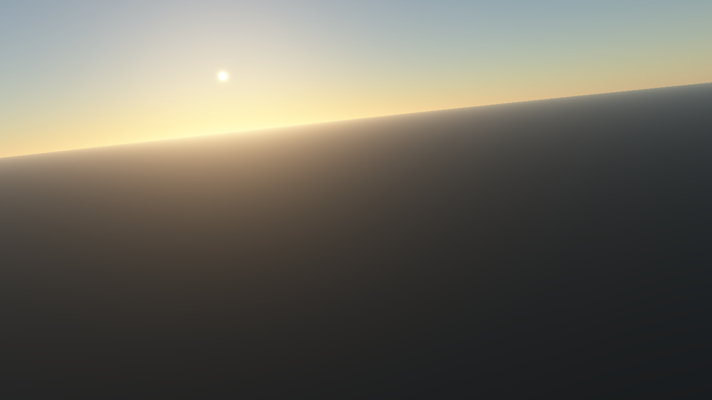

# Atmosphere

The Alire crate orka\_plugins\_atmosphere provides several Ada packages
which can be used to render the atmosphere of the Earth.

!!! info
    The various objects described on this page are declared in
    the package `:::ada Orka.Features.Atmosphere` and its child packages.

Import the following packages:

```ada
with Orka.Features.Atmosphere.Earth;
with Orka.Features.Atmosphere.Rendering;
with Orka.Features.Atmosphere.Cache;
```

## Creating an atmosphere

To render the atmosphere of the Earth, first create a writable location object
where the precomputed textures can be cached:

```ada
Location_Atmosphere_Cache : constant Locations.Writable_Location_Ptr :=
  Locations.Directories.Create_Location ("cache/atmosphere");
```

To create an atmosphere, some data about the atmosphere is needed.
Call the function `Data` in the package `:::ada Earth` to create
an object containing data about the model of the atmosphere:

```ada
Earth_Data : aliased constant Model_Data :=
  Earth.Data (Luminance => Approximate);
```

The parameter `Luminance` can contain the values `None`, `Approximate`, or `Precomputed`.
The value `Precomputed` causes 5 times more wavelengths to be precomputed than
the other two. It gives the highest accuracy of the luminance, but takes much
more time to compute than `Approximate`.

Next, precompute the textures:

```ada
Atmosphere_Textures : constant Precomputed_Textures :=
  Cache.Get_Textures (Context, Earth_Data, Location_Atmosphere_Cache);
```

After the location objects have been created, create the `Atmosphere`
object by calling the function `Create_Atmosphere`:

```ada
Atmosphere_Manager : Rendering.Atmosphere :=
  Rendering.Create_Atmosphere
    (Context, Earth_Data, Atmosphere_Textures);
```

A fourth parameter, `Parameters`, is optional and only needed if the planet is
slightly flattened and the `Flattening` component of the parameters is greater than zero.
The precomputed atmosphere assumes the planet has no flattening (for space/time
complexity reasons), but in reality the semi-minor axis of the Earth (center to
northpole) is 0.3 % of the semi-major axis (center to equator).
This gives a difference of about 20 km. The tessellated terrain can handle flattening,
so a hack is applied when the camera is near the surface to partially fix the
atmosphere near the horizon.

The parameters can be specified as following:

```ada
Planet_Earth : constant Orka.Celestial.Planets.Physical_Characteristics :=
  (Orka.Celestial.Planets.Earth with delta Flattening => 0.0);

Earth_Parameters : constant Orka.Features.Atmosphere.Rendering.Model_Parameters :=
  (Semi_Major_Axis => Planet_Earth.Semi_Major_Axis,
   Flattening      => Planet_Earth.Flattening,
   Axial_Tilt      => Orka.Transforms.Doubles.Matrices.Vectors.To_Radians
                        (Planet_Earth.Axial_Tilt_Deg),
   Star_Radius     => <>);
```

The physical characteristics of several planets are provided by the crate orka\_celestial.

## Rendering

To render the atmosphere, create a frame graph with the function `Create_Graph`
and connect it to your main frame graph:

```ada
Atmosphere_Graph : constant Orka.Frame_Graphs.Frame_Graph :=
  Atmosphere_Manager.Create_Graph (Resource_Color.Description, Resource_Depth.Description);

Resources_Atmosphere : constant Orka.Frame_Graphs.Resource_Array :=
  Main_Graph.Connect (Atmosphere_Graph, [Resource_Color, Resource_Depth]);
```

The variable `Resources_Atmosphere` contains two resources to which yet another frame graph can be connected.
Finally, create a `Renderable_Graph` and call its procedure `Render` to render the whole frame graph.

See [Frame graph](/rendering/frame-graph/) for more information on how to
build and render a frame graph.

!!! tip "Render the atmosphere after the terrain"
    If your application renders an atmosphere as well as a terrain, render the
    atmosphere after the terrain. This reduces the number of invocations of the
    fragment shader.

### Updating the state

Each frame, before presenting one of the resources of the frame graph, update the
state of the atmosphere by calling the procedure `Set_Data`:

```ada
Atmosphere_Manager.Set_Data (Camera, Planet, Sun);
```

The `Camera` needs to be a `Camera_Ptr` (defined in package `:::ada Orka.Cameras`)
and `Planet` and `Sun` need to be pointers to two objects implementing
the interface `Behavior` (defined in package `:::ada Orka.Behaviors`).

### Screenshots

Outside the atmosphere:


Inside the atmosphere:


