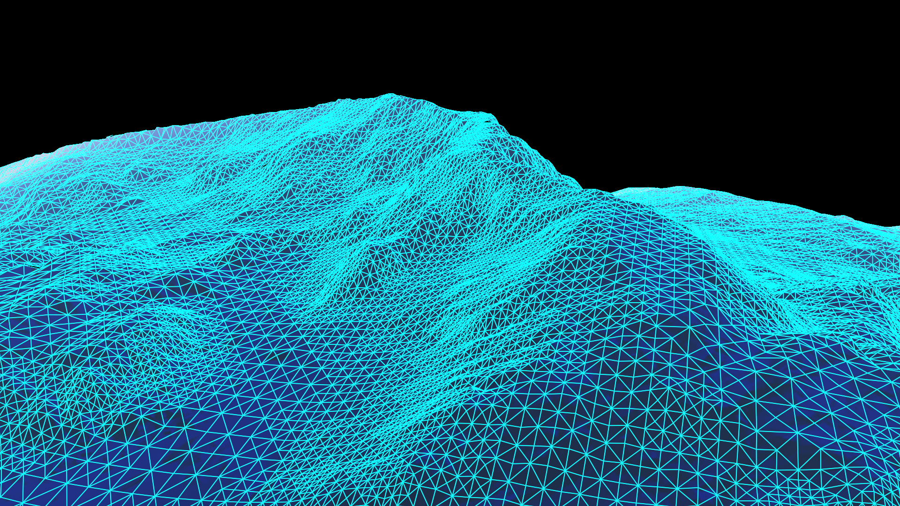

# Terrain

The Alire crate orka\_plugins\_terrain provides packages to render
adaptively tessellated terrain of a planet on the GPU.

- Updates and renders multiple terrain tiles.

- Supports flattened spheroids with warping to reduce RMSE when
projecting cubes on spheres.

- Can optionally display a wireframe on top of the rendered terrain.

!!! info
    The various objects described on this page are declared in
    the package `:::ada Orka.Features.Terrain` and its child packages.

## Creating the terrain

To render the terrain, first create some location objects to find the
shaders of the crate and the height map and shader to render the terrain:

```ada
Location_Data : constant Locations.Location_Ptr :=
  Locations.Directories.Create_Location ("data");

Location_Terrain_Shaders : constant Locations.Location_Ptr :=
  Locations.Directories.Create_Location ("path/to/orka_plugin_terrain/data/shaders");
```

The location `Location_Data` should contain the directory `terrain/`.
This directory should contain the file `terrain-dmap.ktx`,
a height map, and the file `terrain-render-atmosphere.frag`, a fragment shader to
render the terrain. This fragment shader should implement the function
`:::glsl vec4 ShadeFragment(vec2 texCoord, vec4 worldPos)`.
The height map should contain a red channel of type `Unsigned_16`.

Next, create a `Terrain_Planet` object by calling the functions
`Create_Terrain_Planet` in the package `:::ada Orka.Features.Terrain.Planets`:

```ada
Atmosphere_Manager : Orka.Features.Atmosphere.Cache.Cached_Atmosphere :=
  Orka.Features.Atmosphere.Cache.Create_Atmosphere
    (Earth, Location_Atmosphere_Shaders, Location_Precomputed, Earth_Parameters);

Terrain_Manager : Planets.Terrain_Planet := Planets.Create_Terrain_Planet
  (Min_Depth         => 6,
   Max_Depth         => 20,
   Wireframe         => True,
   Location          => Location_Terrain_Shaders,
   Initialize_Render => null,
   Data              => Earth,
   Parameters        => Earth_Parameters,
   Atmosphere        => Atmosphere_Manager,
   Location_Data     => Location_Data,
   Height_Scale      => 8848.0 + 11_000.0,
   Height_Offset     => 11_000.0);
```

See [Atmosphere](/plugins/atmosphere/) on how to create the parameters used
in the call of function `Create_Atmosphere`.

The maximum tessellation is controlled by the parameter `Max_Depth`.
Increase this constant to further subdivide the terrain.
However, older GPUs might not be able to handle values greater than 20.

If `Wireframe` is `True`, then optionally a wireframe can be displayed
when rendering the terrain. In production, this parameter should be set
to `False` to avoid invoking a geometry shader.

The parameters `Height_Scale` and `Height_Offset` should be adjusted depending
on the height map which is used.

!!! warning "A maximum depth of 20 might be too low"
    Intel GPUs cannot handle very large max terrain subdivision levels,
    which limits the maximum terrain resolution.
    Discrete GPUs might be able to handle larger values.
    A value of 20 gives a resolution of about 2 km per triangle for Earth.

### Configuration

To adaptively tessellate terrain, some parameters are needed which specify
how much the terrain should be tessellated:

```ada
Terrain_Parameters : constant Subdivision_Parameters :=
  (Meshlet_Subdivision  => 3,
   Edge_Length_Target   => 16,
   Min_LoD_Standard_Dev => 0.00);
```

## Rendering

To render the terrain, create a frame graph with the function `Create_Graph`
and connect it to your main frame graph:

```ada
Terrain_Graph : constant Orka.Frame_Graphs.Frame_Graph :=
  Terrain_Manager.Create_Graph (Resource_Color.Description, Resource_Depth.Description);

Resources_Terrain : constant Orka.Frame_Graphs.Resource_Array :=
  Main_Graph.Connect (Terrain_Graph, [Resource_Color, Resource_Depth]);
```

The variable `Resources_Terrain` contains two resources to which yet another frame graph can be connected.
Finally, create a `Renderable_Graph` and call its procedure `Render` to render the whole frame graph.

See [Frame graph](/rendering/frame-graph/) for more information on how to
build and render a frame graph.

### Updating the state

Each frame, before presenting one of the resources of the frame graph, update the
state of the terrain by calling the procedure `Set_Data`:

```ada
Terrain_Manager.Set_Data
  (Rotation      => Orka.Transforms.Singles.Matrices.Rz (-Orka.Float_32 (Earth_Parameters.Axial_Tilt)),
   Center        => Translate_From_Camera_To_Planet,
   Camera        => Camera,
   Star          => Direction_From_Planet_To_Star,
   Parameters    => Terrain_Parameters,
   Freeze        => Enable_Terrain_Freeze,
   Wires         => Enable_Terrain_Wires);
```

The parameter `Rotation` should be a `Matrix4` describing the desired rotation
of the planet.
The parameter `Center` should be a `Matrix4` describing the translation
from the camera's view position to the center of the planet, divided
by `Earth_Data.Length_Unit_In_Meters`:

```ada
T ((Planet.Position - Camera.View_Position) * (1.0 / Earth_Data.Length_Unit_In_Meters)`
```

See [Transformations](/transforms/matrices/#transformations) for more information.

The parameters `Freeze` and `Wires` control whether the terrain must be
updated when the camera changes its position and whether a wireframe
must be shown.

### Querying visible tiles

The function `Visible_Tiles` of `Terrain_Manager` can be called to query which tiles are visible
and which are hidden. The function returns an array of six booleans.

### Screenshots

Triangle culling of terrain is based on the frustum and the distance from camera:


Increase the minimum level of detail (LoD) variance to reduce the number
of triangles on flat terrain:


