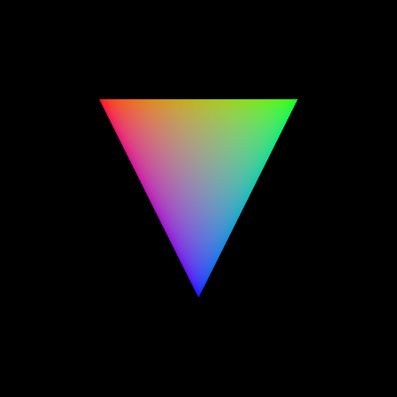

# Introduction

Orka is based on a modern version of OpenGL, an API for rendering
graphics in real-time. OpenGL started way back in 1992. At the time,
graphics processing units (GPUs) were not programmable and the programmer
would manually have to specify the vertices of a 3D model. With the
release of 2.0 in 2004, OpenGL gained the ability to program parts of
the pipeline with shaders, small programs written in a C-style language
that run on the GPU. GPUs became more and more programmable and with
the addition of compute shaders in OpenGL 4.3 in 2012, which can read and
write from large buffers and or textures, one can easily run non-graphics
workloads or do general purpose computing on the GPU (GPGPU).

## Concepts

### Vertices, primitives, and indices

Vertices are the points of a 3D model. For example, a triangle has three
points and a cube has eight. Each vertex has a position vector and optionally
some other data like a normal vector, texture coordinates, or a color.

Primitives are shapes consisting of a number of vertices. A sequence of
vertices can be interpretated as:

- **Points**: Each vertex is a point.

- **Lines**: *n* lines requiring *n* x 2 vertices.

- **Line strip**: *n* - 1 lines requiring *n* vertices.

- **Line loop**: A line strip that forms a circle.

- **Triangles**: *n* triangles requiring *n* x 3 vertices.

- **Triangle strip**: *n* - 2 triangles requiring *n* vertices.

- **Triangle fan**: A cone.

- **Patches**: A special primitive used in tesselation.

3D models are usually rendered using triangles or triangle strips.

Indices are numbers that refer to the vertices. They exist primarily to reduce
the amount of data that is needed to describe a 3D model. Take, for example, a
quad. It consists of four vertices and two triangles. Without indices, the
two vertices (and all their data) on the diagonal would have to be duplicated.
With indices, only six numbers are needed to describe the two triangles.

### Coordinate systems and transformations

In OpenGL the camera or your screen is positioned at the origin
or (0, 0, 0). To give the illusion that the camera is flying through a
3D world, we need to move and rotate the objects so that they have the
correct position relative to the camera. Because objects also are located
at the origin, several matrix transformations need to be applied in the
vertex shader in order to move them into position:

1. **Object space**. The object is at the origin.

2. The position of the object is multiplied with a matrix called the *model matrix*.

3. **World space**. The object has moved to its position in the 3D world.
   In a strategy game, the origin of the world could be a corner of the map,
   and in a flight simulator, the origin of the world could be the center of
   the Earth.

4. The position is multiplied with the *view matrix*.

5. **Eye space**. The object has moved to a position relative to the camera.
   If the camera is looking at the object in world space, then the object
   is now in front of the camera in eye space. The origin in eye space is
   where the camera is.

6. The position is multiplied with the *projection matrix*. This matrix
   causes a perspective or orthographic projection. In the case of a
   perspective projection, objects far away from the camera will appear
   smaller than objects close to the camera.

7. **Clip space**. The components of the position vector are now between
   -1.0 and 1.0. The *x* axis goes from left-to-right and the *y*
   axis from bottom-to-top.
   This vector (and all the previous ones) are actually 4D:
   they have a fourth component called the *w* component. This vector is
   written to `gl_Position` at the end of the vertex shader.

8. OpenGL applies a *perspective division* by dividing the *x*, *y*, and *z*
   components by the *w* component.

9. **Normalized Device Coordinates**. Triangles outside the range of -1.0
   to 1.0 will be clipped.

10. OpenGL maps the NDC to *screen coordinates* (the screen).

The projection matrix is build using the *field of view*, the *aspect ratio*
using the width and height of the window, and the distance of the *near plane*
and *far plane*. Objects between the camera and the near plane or farther than
the far plane are clipped. This matrix is only constructed once or when
the user changes the size of the window.

The view matrix is build using the position and rotation of the camera.
And the model matrices are build using the positions and rotations of the
objects in the scene. The view matrix and object matrices are usually
constructed every frame.

### Interpolation

After the vertices have been moved by the vertex shader to a position on
the screen, the GPU will rasterize the primitives (triangles, etc)
and generate fragments for each pixel inside the primitive. Fragments
receive data output by the vertex shader such as the position, a color,
a texture coordinate, etc. Each fragment inside a primitive is a unique combination
of the vertices of the primitive.

For example, consider a triangle with the vertices *A*, *B*, and *C*. If
we take a point *P* inside this triangle, then we get three new triangles,
each sharing point *P* and two of *A*, *B*, and *C*.

For each of these inner triangles we can compute the ratio of their area
and the area of the triangle ABC. Let's call these areas *u* (= ACP / ABC),
*v* (= ABP / ABC), and *w* (= BCP / ABC).
The point *P* is then a linear combination of these areas and the vertices
of the outer triangle: *P* = *w* x *A* + *u* x *B* + *v* x *C*.

## Objects

Orka provides a few building blocks that can be used to render a 3D model
on the screen.

#### Buffers

Buffers are objects that contain data like vertices or indices. This data
may be accessible by the CPU and/or GPU.

#### Textures

Textures are objects that contain images. Textures are mostly 2D, but can be
1D or 3D as well. A texture can also contain an array of images or multiple
levels where each level has half the resolution of the previous level.

#### Vertex formats

The vertex format describes the attributes of vertices and which buffers
contain which attributes. Usually a vertex has attributes like the position
vector, a normal vector (used for computing lighting), and the texture
coordinate of some texture.

#### Programs

Programs are objects that contains one or more shaders that should be run
on the GPU.

#### Framebuffers

A framebuffer is an object that holds the output of a program that ran
on the GPU. Usually it consists of a color buffer and a depth buffer.
An application always has at least one framebuffer: the default framebuffer,
which is the window of the application. For off-screen rendering, needed
for post-processing, additional framebuffers can be used.

!!! note
    There are a few other objects like samplers, queries, fences, and
    barriers, but we will not discuss those here in the introduction.

## The Graphics Pipeline

The graphics pipeline is a conceptual model that describes how data
(such as a 3D model) is processed and displayed on the screen. It consists
of several stages, some of which are fixed-function, some are configurable,
and some are fully programmable:

1. **Vertex assembly**: Fetches the attributes (position, etc.) of a vertex.
1. **Vertex shader**: A shader which transforms the position (3D) of the
   vertex to a normalized device coordinate (2D and between -1 and 1).
1. **Primitive assembly**: Clips primitives if they intersect with the edge
   of the screen and hands it over to the next stage.
1. **Rasterizer**: Turns the visible parts of primitives into a bunch of
   fragments (pixels).
1. **Fragment shader**: A shader that computes the color of each fragment.
1. **Blending**: Blends the color of the fragment with the previous color
   if multiple primitives are rendered on top of each other.

Besides the graphics pipeline, which results in an image displayed on the
screen, there is also a separate compute pipeline which consists of just
one stage:

1. **Compute shader**: Reads from and writes to buffers and textures.
   Useful for non-graphics tasks like computing if a 3D model would show
   up on the screen or if it is out of view or behind another 3D model, or
   to do image post-processing.

Note that, on modern GPUs, all shader types are executed on generic
shader units.

## Rendering a triangle

Let's render a triangle on the screen! First we need to create a few
objects and then draw the triangle in a loop.

### Creating objects

#### Window

First we need to initialize the OpenGL context and create a window:

```ada
Library : constant Orka.Contexts.Library'Class :=
  := Orka.Windows.GLFW.Initialize (Major => 4, Minor => 2);

Window : aliased Orka.Windows.Window'Class
  := Library.Create_Window (Width => 500, Height => 500);

Context : Orka.Contexts.Context'Class := Window.Context;
pragma Unreferenced (Context);
```

#### Buffer

Next we will create a buffer and upload the data of the three
vertices to it:

```ada
Vertices : constant Single_Array
  := (-0.5, -0.5,     1.0, 0.0, 0.0,
       0.5, -0.5,     0.0, 1.0, 0.0,
       0.0,  0.5,     0.0, 0.0, 1.0);

--  Upload Vertices data to buffer
Buffer_1 : constant Buffer := Create_Buffer ((others => False), Vertices);
```

Each vertex has a position (2D vector) and a color (3D vector).

#### Vertex format

Next step is to create a vertex format with one attribute buffer. An
attribute buffer has one or more attributes and is given a `Buffer` where
it can fetch its vertices from.

In our case the attribute buffer has two attributes (position and color):

```ada
function Create_Format return Vertex_Format is
   use all type Orka.Types.Element_Type;

   procedure Add_Vertex_Attributes (Buffer : in out Attribute_Buffer) is
   begin
      --  Location 0 consists of 2 singles and 1 consists of 3 singles
      Buffer.Add_Attribute (0, 2);
      Buffer.Add_Attribute (1, 3);
   end Add_Vertex_Attributes;
begin
   --  Create mesh and its attributes
   return Result : Vertex_Format := Create_Vertex_Format (UInt_Type) do
      Result.Add_Attribute_Buffer (Single_Type, Add_Vertex_Attributes'Access);
   end return;
end Create_Format;

VF_1 : Vertex_Format := Create_Format;
```

Later we set `Buffer_1` as the buffer for the attribute buffer
that we have created:

```ada
VF_1.Bind;
VF_1.Set_Vertex_Buffer (1, Buffer_1);
```

#### Program

The fourth step is to create a program with a vertex shader and a fragment
shader. Save the following vertex shader in `triangle.vert`:

```glsl linenums="1"
#version 420 core

layout(location = 0) in vec2 in_Position;
layout(location = 1) in vec3 in_Color;

out vec3 ex_Color;

void main(void) {
   gl_Position = vec4(in_Position, 0.0, 1.0);
   ex_Color = in_Color;
}
```

And the following fragment shader in `triangle.frag`:

```glsl linenums="1"
#version 420 core

in  vec3 ex_Color;
out vec4 out_Color;

const float gamma = 2.2;
const vec3 inverse_gamma = vec3(1.0 / gamma);

void main(void) {
   // Apply gamma correction to the triangle
   out_Color = vec4(pow(ex_Color, inverse_gamma), 1.0);
}
```

The program is then created as follows:

```ada
Location_Shaders : constant Locations.Location_Ptr
  := Locations.Directories.Create_Location (".");

Program_1 : Program := Create_Program (Modules.Create_Module
  (Location_Shaders, VS => "triangle.vert", FS => "triangle.frag"));
```

`Location_Shader` is an object that loads `triangle.vert` and
`triangle.frag` from the current directory. Let's tell
OpenGL that we want to use this program:

```ada
Program_1.Use_Program;
```

#### Framebuffer

The last object that we need to create is the framebuffer:

```ada
FB_1 : Framebuffer := Get_Default_Framebuffer (Window);
```

Specify the color of the background and tell OpenGL we want to use
this framebuffer:

```ada
FB_1.Set_Default_Values
  ((Color => (0.0, 0.0, 0.0, 1.0), others => <>));

FB_1.Use_Framebuffer;
```

### Rendering in a loop

After we have created all the objects, we can render the triangle:

```ada
while not Window.Should_Close loop
   Window.Process_Input;

   FB_1.Clear;
   Orka.Rendering.Drawing.Draw (Triangles, 0, 3);

   Window.Swap_Buffers;
end loop;
```

Each frame we process input from the keyboard and mouse, clear the screen
and then draw the triangle. Press ++esc++ to close the application.



??? example "Complete code of `triangle.adb`"
    ```ada linenums="1"
    with GL.Types;

    with Orka.Contexts;
    with Orka.Rendering.Buffers;
    with Orka.Rendering.Drawing;
    with Orka.Rendering.Framebuffers;
    with Orka.Rendering.Programs.Modules;
    with Orka.Rendering.Vertex_Formats;
    with Orka.Resources.Locations.Directories;
    with Orka.Types;
    with Orka.Windows.GLFW;

    procedure Triangle is
       Library : constant Orka.Contexts.Library'Class :=
         := Orka.Windows.GLFW.Initialize (Major => 4, Minor => 2);

       Window : aliased Orka.Windows.Window'Class
         := Library.Create_Window (Width => 500, Height => 500);

       Context : Orka.Contexts.Context'Class := Window.Context;
       pragma Unreferenced (Context);

       use Orka.Resources;
       use Orka.Rendering.Buffers;
       use Orka.Rendering.Programs;
       use Orka.Rendering.Framebuffers;
       use Orka.Rendering.Vertex_Formats;

       use GL.Types;

       function Create_Format return Vertex_Format is
          use all type Orka.Types.Element_Type;

          procedure Add_Vertex_Attributes (Buffer : in out Attribute_Buffer) is
          begin
             --  Location 0 consists of 2 singles and 1 consists of 3 singles
             Buffer.Add_Attribute (0, 2);
             Buffer.Add_Attribute (1, 3);
          end Add_Vertex_Attributes;
       begin
          --  Create mesh and its attributes
          return Result : Vertex_Format := Create_Vertex_Format (UInt_Type) do
             Result.Add_Attribute_Buffer (Single_Type, Add_Vertex_Attributes'Access);
          end return;
       end Create_Format;

       Location_Shaders : constant Locations.Location_Ptr
         := Locations.Directories.Create_Location (".");

       Program_1 : Program := Create_Program (Modules.Create_Module
         (Location_Shaders, VS => "triangle.vert", FS => "triangle.frag"));

       FB_1 : Framebuffer := Get_Default_Framebuffer (Window);

       VF_1 : Vertex_Format := Create_Format;

       Vertices : constant Single_Array
         := (-0.5, -0.5,     1.0, 0.0, 0.0,
              0.5, -0.5,     0.0, 1.0, 0.0,
              0.0,  0.5,     0.0, 0.0, 1.0);

       --  Upload Vertices data to buffer
       Buffer_1 : constant Buffer := Create_Buffer ((others => False), Vertices);
    begin
       VF_1.Bind;
       VF_1.Set_Vertex_Buffer (1, Buffer_1);

       FB_1.Set_Default_Values
         ((Color => (0.0, 0.0, 0.0, 1.0), others => <>));

       FB_1.Use_Framebuffer;
       Program_1.Use_Program;

       while not Window.Should_Close loop
          Window.Process_Input;

          FB_1.Clear;
          Orka.Rendering.Drawing.Draw (Triangles, 0, 3);

          Window.Swap_Buffers;
       end loop;
    end Triangle;
    ```

### Exercises

??? question "Exercise 1: Give the window a red background instead of black"
    ```ada
    FB_1.Set_Default_Values
      ((Color => (1.0, 0.0, 0.0, 1.0), others => <>));
    ```

??? question "Exercise 2: Try to disable the gamma correction in `triangle.frag`"
    ```glsl
    out_Color = vec4(ex_Color, 1.0);
    ```
